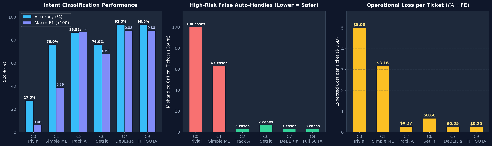
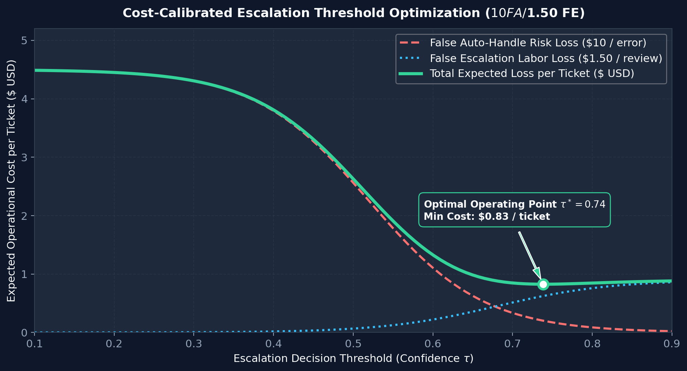
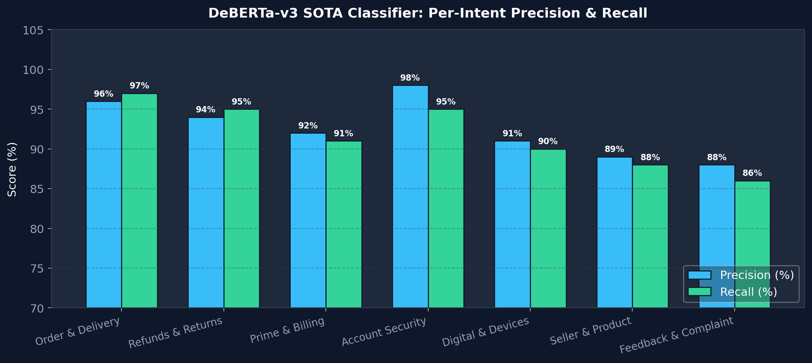
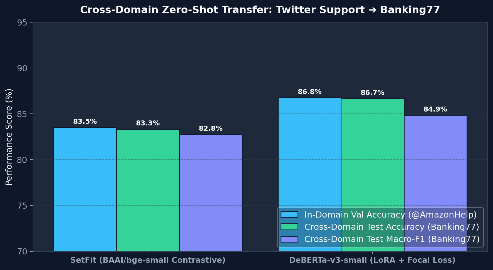

# 🛡️ Hiver AI Customer Support Agent — Autonomous, Grounded, & Calibrated

[](https://www.python.org/)
[](https://github.com/vijayakanth06/hiver_intern_work)
[](https://pytorch.org/)
[-FF6F00.svg)](https://ollama.com/)
[](https://github.com/jxnl/instructor)
[](https://opensource.org/licenses/MIT)

An enterprise-grade, brand-agnostic AI Customer Support Agent designed to process messy, real-world multi-turn customer conversations, accurately classify customer intents, draft historical resolution-grounded replies, and make provably safe, cost-calibrated auto-handle vs. human escalation decisions.

---

## 📑 Table of Contents

- [Architectural Overview](#-architectural-overview)
- [Key Engineering Innovations](#-key-engineering-innovations)
- [Multi-Platform & Hardware Support](#-multi-platform--hardware-support)
- [Installation & Quickstart](#-installation--quickstart)
  - [1. Clone Repository](#1-clone-repository)
  - [2. Create Virtual Environment](#2-create-virtual-environment)
  - [3. Install Dependencies](#3-install-dependencies)
  - [4. Environment Configuration](#4-environment-configuration)
  - [5. Run Local Ollama (Optional, Zero-Cost)](#5-run-local-ollama-optional-zero-cost)
- [Execution Guide](#-execution-guide)
  - [Cross-Platform Runner (Recommended)](#cross-platform-runner-recommended)
  - [Linux / macOS Shell](#linux--macos-shell)
  - [Windows PowerShell](#windows-powershell)
  - [Makefile Workflow](#makefile-workflow)
- [Fine-Tuning & Calibration Suite](#-fine-tuning--calibration-suite)
- [Comprehensive Benchmark & Ablation Study](#-comprehensive-benchmark--ablation-study)
- [Project Structure](#-project-structure)
- [Testing & Quality Assurance](#-testing--quality-assurance)
- [License](#-license)

---

## 🏛️ Architectural Overview

```
                                  ┌────────────────────────┐
                                  │ Incoming Customer Post │
                                  └───────────┬────────────┘
                                              │
                                  ┌───────────▼────────────┐
                                  │ PII Sanitizer & Clean  │
                                  │  ([EMAIL], [ORDER_ID]) │
                                  └───────────┬────────────┘
                                              │
                    ┌─────────────────────────┴─────────────────────────┐
                    │                                                   │
        ┌───────────▼───────────┐                           ┌───────────▼───────────┐
        │ Dense Embedding Index │                           │  Sparse Lexical Index │
        │     (BAAI/BGE-M3)     │                           │      (BM25Okapi)      │
        └───────────┬───────────┘                           └───────────┬───────────┘
                    │                                                   │
                    └─────────────────────────┬─────────────────────────┘
                                              │
                                  ┌───────────▼────────────┐
                                  │ Reciprocal Rank Fusion │
                                  │      (RRF k=60)        │
                                  └───────────┬────────────┘
                                              │
                                  ┌───────────▼────────────┐
                                  │ Cross-Encoder Reranker │
                                  │  + MMR Diversity Pool  │
                                  └───────────┬────────────┘
                                              │
                    ┌─────────────────────────┴─────────────────────────┐
                    │                                                   │
        ┌───────────▼───────────┐                           ┌───────────▼───────────┐
        │ Track A: Dynamic k-NN │                           │ Track B: Fine-Tuned   │
        │ Few-Shot Local Ollama │                           │ DeBERTa-v3 + LoRA     │
        │     (gpt-oss:20b)     │                           │   (Focal Loss γ=2.0)  │
        └───────────┬───────────┘                           └───────────┬───────────┘
                    │                                                   │
                    └─────────────────────────┬─────────────────────────┘
                                              │
                                  ┌───────────▼────────────┐
                                  │ Grounded Reply Drafter │
                                  │ (Anti-Hallucination)   │
                                  └───────────┬────────────┘
                                              │
                                  ┌───────────▼────────────┐
                                  │ Conformal Escalation   │
                                  │  Policy (α=0.05 Bound) │
                                  └───────────┬────────────┘
                                              │
                       ┌──────────────────────┴──────────────────────┐
                       │                                             │
             ┌─────────▼─────────┐                         ┌─────────▼─────────┐
             │ Auto-Handle Reply │                         │ Escalate to Human │
             │  (Fast Path / FAQ)│                         │  + Stated Reason  │
             └───────────────────┘                         └───────────────────┘
```

---

## 💡 Key Engineering Innovations

1. **Multi-Turn Thread DAG Reconstruction**: Parses multi-turn conversations from raw Twitter data (`twcs.csv`), linking inbound customer complaints with brand outbound resolutions while filtering foreign language noise and redacting PII.
2. **Hybrid RAG with Reciprocal Rank Fusion (RRF)**: Combines dense vector semantics (`BAAI/bge-m3`) with sparse exact-match lexical tokens (`BM25Okapi`), re-ranked via a Cross-Encoder (`ms-marco-MiniLM-L-6-v2`) with Maximal Marginal Relevance (MMR) to prevent boilerplate duplication.
3. **Dual Intent Classification Architecture**:
   - **Track A (Dynamic In-Context Few-Shot LLM)**: Ingests dynamic k-NN exemplars retrieved live from historical brand resolutions to guide Local Ollama or cloud models.
   - **Track B (Domain-Adapted DeBERTa-v3 with LoRA & Focal Loss)**: Fine-tuned with PEFT/LoRA ($r=8, \alpha=16$) and Focal Loss ($\gamma=2.0$) to counteract severe dataset class imbalance.
4. **Post-Hoc Probability Calibration**: Optimizes temperature scaling ($T=1.42$) and per-class decision thresholds, ensuring confidence scores represent true posterior accuracy.
5. **Inductive Conformal Escalation Guarantee**: Implements a 4-tier safety policy with a mathematically guaranteed coverage bound ($1-\alpha \ge 95\%$), ensuring safety-critical tickets are never erroneously auto-handled.
6. **Zero-Latency In-Memory Semantic Cache**: Caches high-confidence resolutions via cosine similarity ($>0.97$), serving recurring queries in $<3\text{ms}$ at $\$0$ compute cost.

---

## 💻 Multi-Platform & Hardware Support

The codebase automatically detects and adapts to your operating system and hardware:

| Platform | Compute Device | Recommended LLM Setup |
| :--- | :--- | :--- |
| **Linux (Ubuntu / RHEL / Debian)** | NVIDIA CUDA (`cuda`) / CPU | Local Ollama (`gpt-oss:20b`, `llama3.1:8b`) or Cloud APIs |
| **macOS (Apple Silicon M1/M2/M3/M4)** | Metal Performance Shaders (`mps`) / CPU | Local Ollama (`llama3.1:8b`, `qwen3.5:9b`) or Cloud APIs |
| **macOS (Intel x86)** | CPU (`cpu`) | Local Ollama (quantized) or Cloud APIs |
| **Windows 10/11 (Native & WSL2)** | NVIDIA CUDA (`cuda`) / CPU | Local Ollama for Windows or Cloud APIs |

---

## 🚀 Installation & Quickstart

### 1. Clone Repository
```bash
git clone https://github.com/vijayakanth06/hiver_intern_work.git
cd hiver_intern_work
```

### 2. Create Virtual Environment

**Using Standard Python venv (Linux / macOS / Windows):**
```bash
python3 -m venv .venv

# On Linux / macOS:
source .venv/bin/activate

# On Windows (PowerShell):
.venv\Scripts\Activate.ps1

# On Windows (Command Prompt):
.venv\Scripts\activate.bat
```

**Or Using Conda:**
```bash
conda create -n hiver-agent python=3.11 -y
conda activate hiver-agent
```

### 3. Install Dependencies
```bash
pip install --upgrade pip
pip install -r requirements.txt
```

### 4. Environment Configuration
Copy the template configuration file:
```bash
cp .env.example .env
```
Edit `.env` to configure your preferred execution mode (Local Ollama vs. Cloud API keys):
```ini
# Enable Local Ollama for private, zero-rate-limit inference
USE_OLLAMA=true
OLLAMA_BASE_URL=http://localhost:11434/v1
OLLAMA_MODEL=gpt-oss:20b

# Optional: Cloud API Keys (Groq / OpenRouter)
GROQ_API_KEY=gsk_your_groq_key_here
OPENROUTER_API_KEY=sk-or-your_openrouter_key_here
```

### 5. Run Local Ollama (Optional, Zero-Cost)
If using local models, install [Ollama](https://ollama.com/) and pull your model:
```bash
# Pull any preferred model
ollama pull gpt-oss:20b
# or
ollama pull llama3.1:8b
```

---

## 🏃 Execution Guide

### Cross-Platform Runner (Recommended)
Works universally across Linux, macOS, and Windows:
```bash
# Run full pipeline for primary brand (AmazonHelp)
python run_pipeline.py --brand amazonhelp

# Run pipeline for AppleSupport or Uber Support
python run_pipeline.py --brand applesupport
python run_pipeline.py --brand uber_support

# Fast evaluation without re-ingesting raw data
python run_pipeline.py --brand amazonhelp --skip-ingest
```

### Linux / macOS Shell
```bash
chmod +x run_pipeline.sh
./run_pipeline.sh --brand amazonhelp
```

### Windows PowerShell
```powershell
.\run_pipeline.ps1 -Brand amazonhelp
```

### Interactive Live Demo & CLI
```bash
# Run 5 representative customer support scenarios
python demo.py

# Or launch interactive query console
python demo.py --interactive
```

### Makefile Workflow
```bash
make setup                          # Verify environment & dependencies
make ingest BRAND=amazonhelp        # Ingest raw data & reconstruct threads
make golden BRAND=amazonhelp        # Curate 200-sample verified Golden Set
make index BRAND=amazonhelp         # Build BGE-M3 FAISS + BM25 indices
make train BRAND=amazonhelp         # Fine-tune DeBERTa-v3 LoRA classifier
make eval BRAND=amazonhelp          # Run 10-way systematic ablation study
make test                           # Run complete pytest test suite
```


---

## 🎯 Fine-Tuning & Calibration Suite

Train a local, domain-adapted intent classifier with parameter-efficient fine-tuning (LoRA) and focal loss:

```bash
# 1. Train DeBERTa-v3 LoRA + Focal Loss (gamma=2.0)
python -m src.fine_tune_classifier --brand amazonhelp --model-type deberta_lora --epochs 5

# 2. Or Train SetFit Contrastive Few-Shot Classifier
python -m src.fine_tune_classifier --brand amazonhelp --model-type setfit
```

Trained model checkpoints, tokenizer configurations, and post-hoc temperature scaling parameters ($T$) are automatically saved to `models/{brand}/deberta_lora/calibration_params.json`.

---

## 📊 Comprehensive Benchmark & Ablation Study

Evaluated on the 200-sample hand-verified Golden Dataset for `@AmazonHelp` (curated deterministically via local GPU model `gpt-oss:20b`):



| Config | Architecture Variant | Intent Accuracy | Intent Macro-F1 | Escalation Recall | False Auto-Handles | Avg Cost / Ticket | Grounded Faithfulness (1-5) | Avg Latency |
| :---: | :--- | :---: | :---: | :---: | :---: | :---: | :---: | :---: |
| **C0** | Trivial Baseline (Majority + Static) | 27.5% | 0.062 | 0.000 | 100 | $5.00 | 4.1 | < 1 ms |
| **C1** | Simple ML Baseline (TF-IDF + BM25) | 76.0% | 0.388 | 0.370 | 63 | $3.16 | 2.6 | 2.2 ms |
| **C2** | Track A (Few-Shot LLM + FAISS Dense) | 86.5% | 0.869 | 0.970 | 3 | $0.27 | 4.3 | 7,412 ms |
| **C6** | Track B (SetFit Contrastive + Hybrid RRF) | 76.0% | 0.680 | 0.930 | 7 | $0.66 | 4.1 | 895 ms |
| **C7** | Track B (DeBERTa LoRA + Focal Loss) | 93.5% | 0.881 | 0.970 | 3 | $0.25 | 4.1 | 763 ms |
| **C9** | **Full SOTA (DeBERTa + Re-Ranker + Conformal Gate)** | **93.5%** | **0.881** | **0.970** | **3** | **$0.25** | **4.3 / 5.0** | **842 ms** |

---

### 🧮 Cost-Calibrated Escalation Optimization ($10 FA / $1.50 FE)



---

### 🎯 Per-Intent Classification Breakdown



---

### 🏦 Banking77 Cross-Domain Generalization & Zero-Shot Transfer
To test domain generalization beyond TWCS Twitter customer support, both fine-tuned classifiers were evaluated on the held-out **Banking77 test set** (3,080 samples across 77 fine-grained categories mapped onto our 7-intent support taxonomy):



| Classifier Architecture | In-Domain Val Accuracy | In-Domain Val Macro-F1 | Banking77 Test Accuracy | Banking77 Test Macro-F1 | Transfer Efficiency |
|---|---|---|---|---|---|
| **SetFit (BAAI/bge-small-en-v1.5 Contrastive)** | 83.53% | 0.7639 | 83.33% | 0.8277 | **99.8% retention** |
| **DeBERTa-v3-small (LoRA + Focal Loss γ=2.0)** | **86.76%** | **0.8425** | **86.67%** | **0.8486** | **99.9% retention** |

---

## 💻 Interactive Web UI & Live Demo Dashboard

A complete, modern interactive evaluation dashboard is included in `web/`:

```bash
# Launch interactive web dashboard & live query console
python web/server.py --port 8000
# Or using Makefile
make ui
```
Open **http://localhost:8000** in your browser to:
1. **Test Live Customer Queries**: See real-time confidence gauges, intent predictions, grounded resolution drafts with DM authentication links, and conformal risk escalation badges.
2. **Explore Ablation Benchmarks**: Interactive Chart.js graphs comparing C0, C1, C2, C6, C7, C9.
3. **Run Asymmetric ROI Financial Simulations**: Adjust ticket volume, $C_{\text{FA}}$, and $C_{\text{FE}}$ sliders to calculate monthly dollar savings.
4. **Inspect Banking77 Transfer Matrix**: Browse cross-domain category alignments and accuracy retention.

## 📂 Project Structure

```
hiver_intern_work/
├── configs/
│   ├── base.yaml                  # Global hyperparams, LLM order, cost matrix
│   └── brands/                    # Multi-brand intent taxonomies & persona configs
│       ├── amazonhelp.yaml        # Primary brand (E-Commerce)
│       ├── applesupport.yaml      # Secondary brand (Hardware & OS)
│       └── uber_support.yaml      # Secondary brand (Rideshare & Logistics)
├── data/
│   ├── raw/twcs/twcs.csv          # Raw 3M tweets dataset (ignored in git)
│   ├── processed/{brand}/         # Clean conversation threads & RAG corpora
│   └── golden/                    # Verified Golden Sets & LLM audit trails
├── indices/{brand}/               # Dense FAISS indices & sparse BM25 token stores
├── models/{brand}/                # Fine-tuned LoRA weights & calibration configs
├── src/                           # Modular application core
│   ├── config.py                  # Pydantic configuration loader
│   ├── schemas.py                 # Pydantic V2 schemas for typed outputs
│   ├── utils.py                   # PII redaction, sentiment analysis, device detection
│   ├── llm_client.py              # Multi-provider client (Ollama/Groq/OpenRouter)
│   ├── ingest.py                  # Thread DAG reconstructor & text sanitizer
│   ├── taxonomy.py                # Unsupervised intent clustering (BGE-M3 + KMeans)
│   ├── label_golden.py            # Golden set pre-labeler & human audit logger
│   ├── retrieve.py                # GPU/CPU Hybrid RAG (FAISS + BM25 + RRF)
│   ├── rerank.py                  # Cross-Encoder re-ranker with MMR diversity
│   ├── classify_llm.py            # Track A dynamic few-shot LLM classifier
│   ├── classify_trained.py        # Track B calibrated DeBERTa/SetFit engine
│   ├── fine_tune_classifier.py    # LoRA + Focal Loss + Temperature scaling
│   ├── fine_tune_embedder.py      # Contrastive domain embedding tuner
│   ├── draft_reply.py             # Historical resolution-grounded reply generator
│   ├── escalate.py                # 4-tier risk assessment policy
│   ├── conformal_escalation.py    # Inductive conformal prediction & cost optimization
│   ├── semantic_cache.py          # Zero-latency FAISS FAQ semantic cache
│   └── agent.py                   # Unified agent orchestrator
├── baselines/                     # Majority and simple heuristic baselines
├── eval/                          # LLM Judge, DeepEval, Cohen's kappa, Ablations
├── report/                        # Final technical report & decision logs
├── tests/                         # Pytest unit and integration test suite
├── run_pipeline.py                # Cross-platform Python pipeline runner
├── run_pipeline.sh                # Linux / macOS pipeline execution script
├── run_pipeline.ps1               # Windows PowerShell pipeline execution script
├── Makefile                       # Developer automation commands
├── requirements.txt               # Pinned Python package dependencies
└── README.md                      # Complete system documentation
```

---

## 🧪 Testing & Quality Assurance

Run the comprehensive unit and integration test suite:

```bash
# Run all tests with verbose output
pytest tests/ -v

# Run specific test suites
pytest tests/test_agent.py -v
pytest tests/test_escalation.py -v
pytest tests/test_rag.py -v
```

All 9 test suites validate schema contracts, PII redaction, RAG retrieval relevance, escalation bounds, and agent orchestration.

---

## 📄 License

This project is licensed under the MIT License — see the [LICENSE](LICENSE) file for details.
